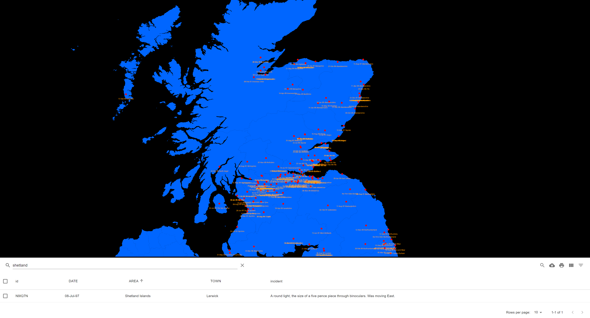

# UFO sighting map for UK 🛸👽

This is based of the details contained in the PDFs found here:

https://www.gov.uk/government/publications/ufo-reports-in-the-uk


## Updating the CSV extracts

So I used poetry in this for my python setup - deets here: https://python-poetry.org/ 🐍

In order to do this you need to fetch a list of the PDFS on the web page, this handle loop in bash will do it for you:

```shell
> pdf-list.txt
for i in `curl https://www.gov.uk/government/publications/ufo-reports-in-the-uk | grep -io '<a href=['"'"'"][^"'"'"']*['"'"'"]' |   sed -e 's/^<a href=["'"'"']//i' -e 's/["'"'"']$//i'`
do
    echo $i >> pdf-list.txt
done
```

Next install the python deps:

```shell
cd data-sanitation
poetry install
```

Next fetch the PDFs and transpose them to CSVS:

```shell
poetry run python ufo-map/fetch_csv.py
```

> :warning: **You may have to sanitise the CSV files as they are in bonkers formatting**

To do this you can install CSV edit on vscode and open the file make sure the colums all look like this as an example:

```csv
Date,Town,Area,Incident
31-Oct-97,Hanwell,Middlesex,"One triangular shaped object, similar size to an airliner. It was black in colour. It was moving in a North Westerly direction."
```

Now we need to transpose this data so that our JS app can render a map of all the sightings and a table, run this:

```shell
poetry run python transpose_sightings.py
```

Woohoo you're onto the JS bit 🔥🎆🎇

## Start the JS app

Now we need to cd into the ufo-map-js folder and run:

```shell
npm install
```

Then we should only need to run this:

```shell
npm start
```

Wala! You have a spooky map of sightings a table look through! 👻🚀🌌🛰☄
